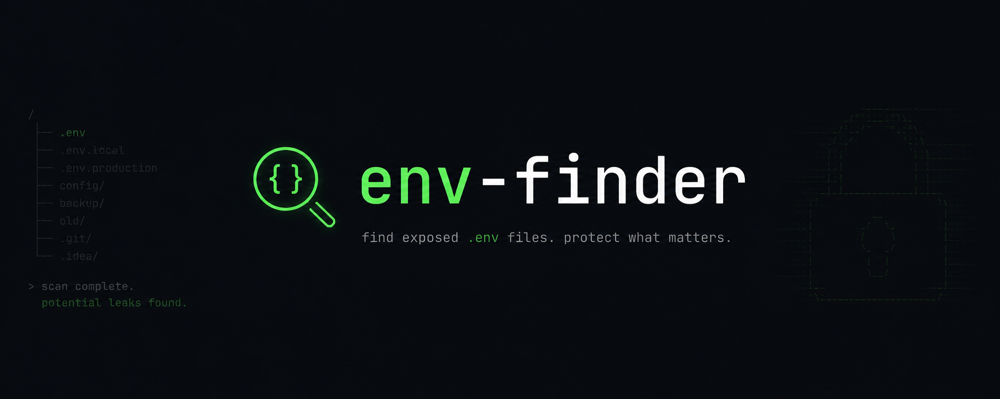

# EnvFinder

EnvFinder is a security research tool that helps identify accidentally exposed configuration
files (.env files) in public github repositories to support responsible disclosure and defensive
analysis.

---


## <u>Run Locally using Docker</u>

1. Clone the Repository

```bash
  git clone https://github.com/RealGalaxyCat/env-finder
```

---

2. Go into the project directory

```bash
  cd env-finder
```

---


3. Add an `.env` file and set `GITHUB_PAT` to your personal access token

<details>
    <summary>ℹ️ How do I generate a PAT?</summary>
    Click on your Github avatar in the top right corner → Settings → Developer Settings → Personal access tokens → Tokens (classic) → Generate new token → select a classic token
</details>

```
GITHUB_PAT=<your_pat>
```

---

4. Start the service

```bash
  docker compose up
```


---

## <u>Responsible Use</u>

This tool is intended for ethical security research and defensive analysis only.

Users are responsible for complying with:
- GitHub Terms of Service
- Applicable laws and regulations
- Responsible disclosure practices

Do not use this tool to access systems without authorization.
